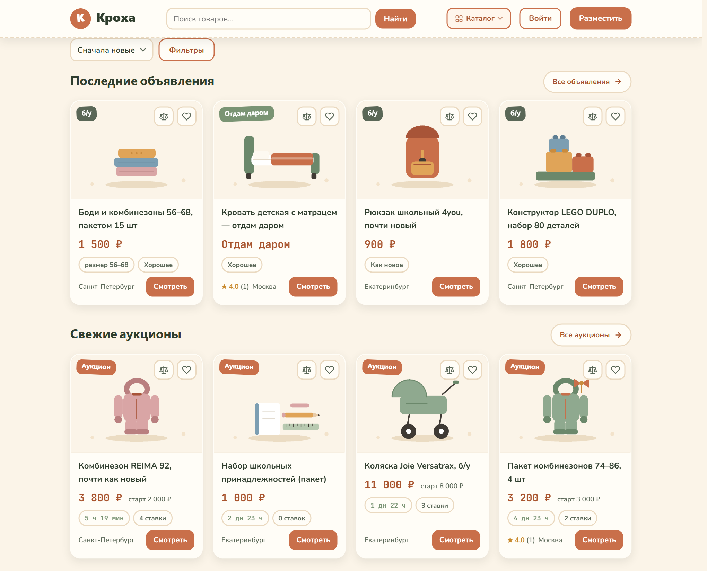
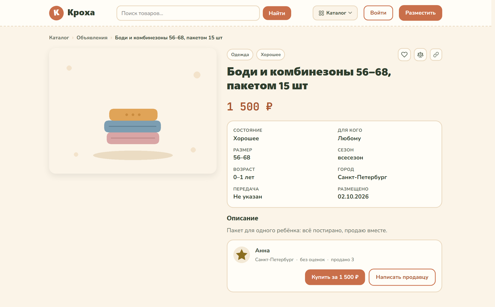
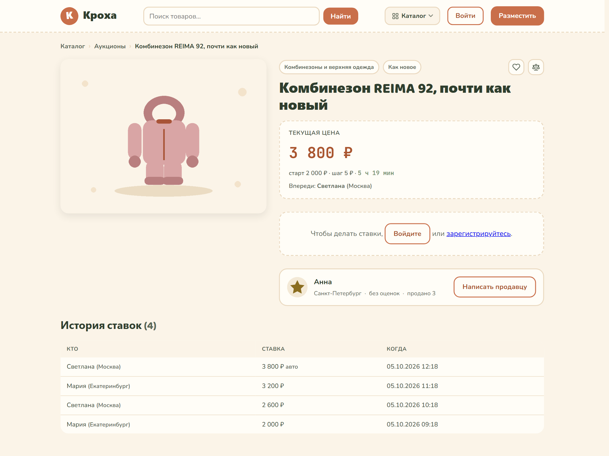
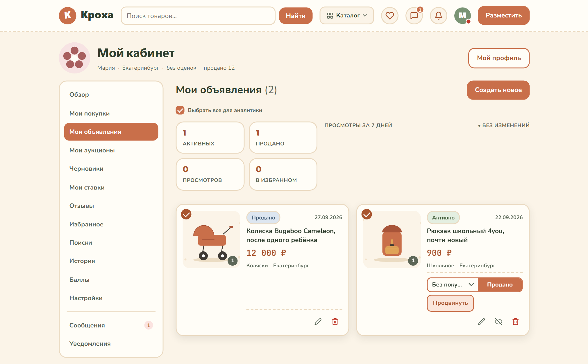
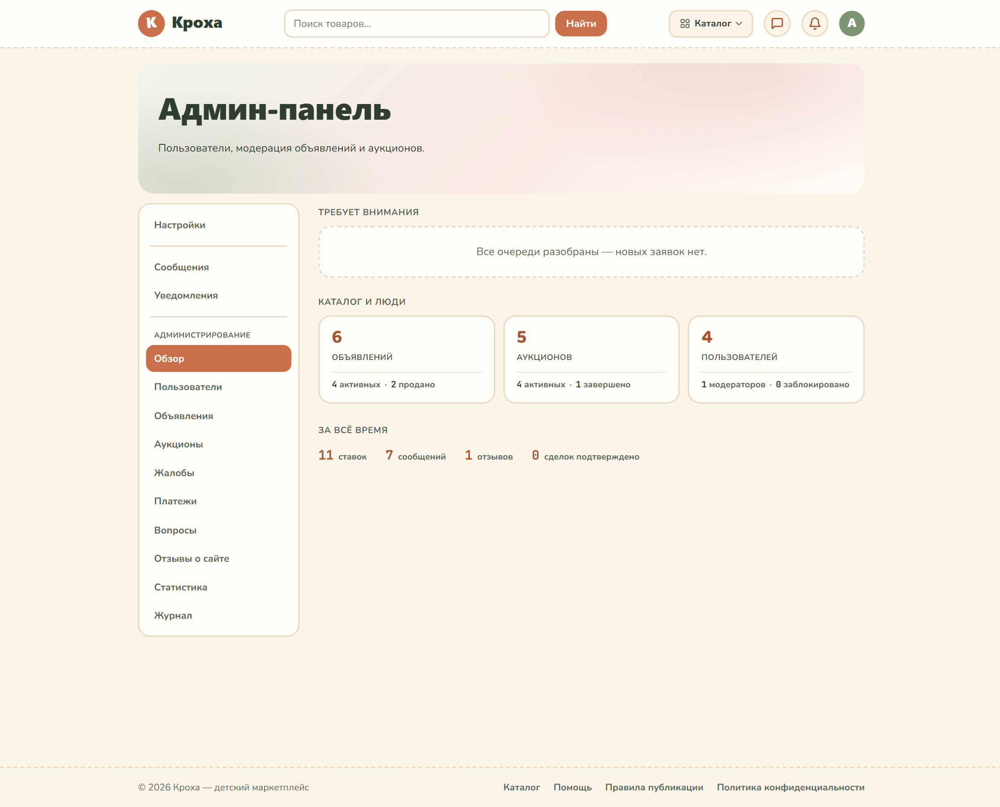
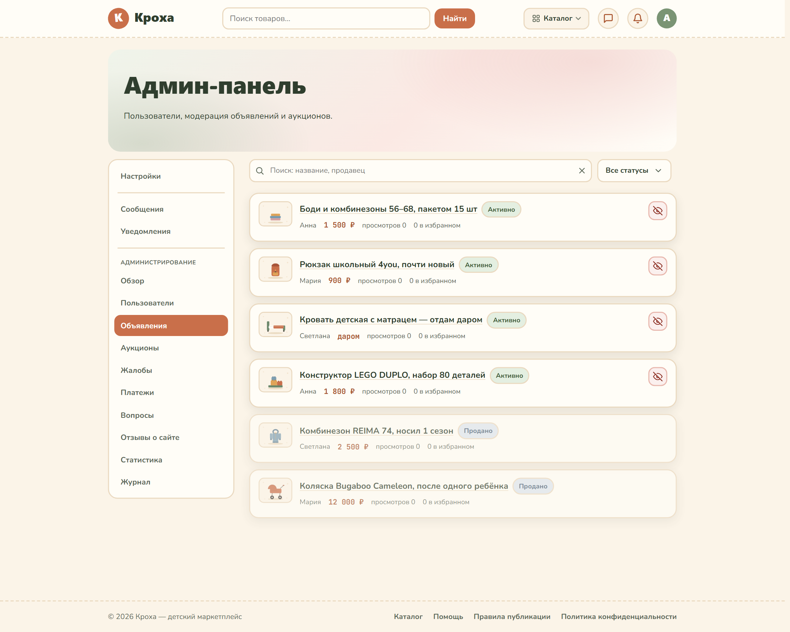
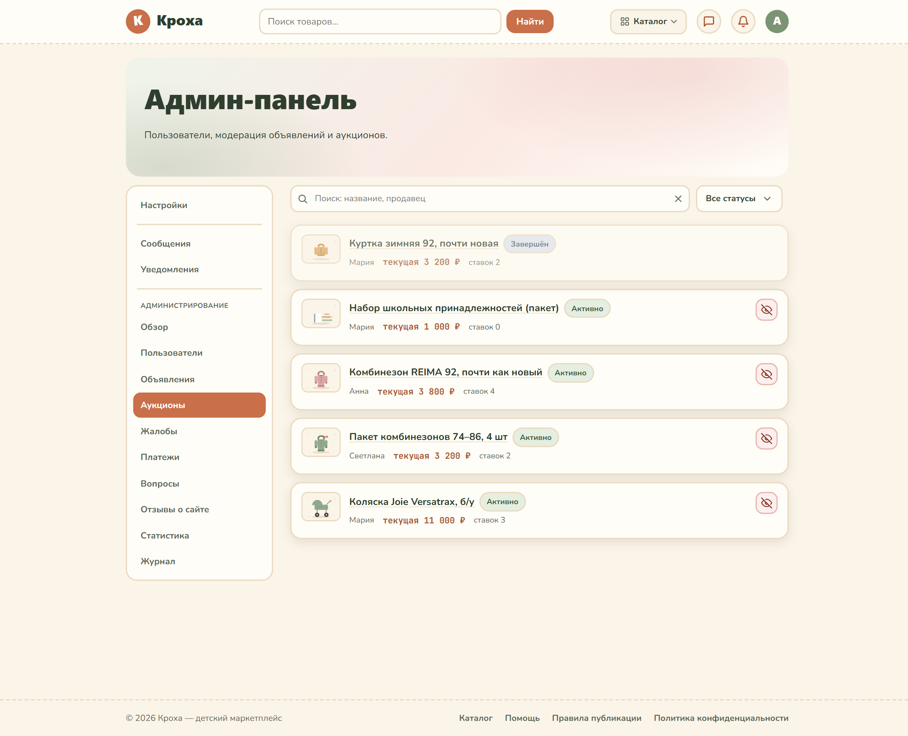
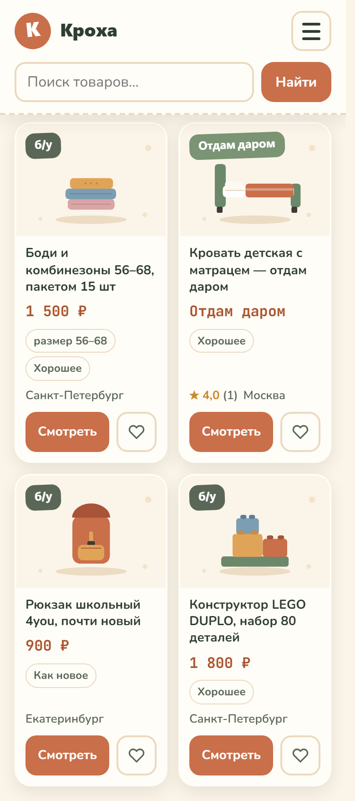

# Кроха — маркетплейс детских вещей с аукционами

Нишевая C2C-площадка, где родители продают и покупают детские вещи двумя способами: по фиксированной цене и через аукцион. Полный цикл сделки — от публикации объявления до взаимных отзывов, — с модерацией, встроенными сообщениями, уведомлениями и админ-панелью.

> Это витрина проекта. Исходный код закрыт и в этом репозитории не публикуется: он хранится в приватном репозитории и предоставляется по запросу.

---

## 1. Задача

Детские вещи почти не успевают износиться, но продать их на общих площадках тяжело:

- каталог замусорен, нишевых фильтров нет — нельзя искать по возрасту ребёнка, размеру и сезону;
- продвижение платное и непрозрачное, объявления месяцами висят без просмотров;
- покупатели боятся переплатить и обмана, продавцы тратят время на «поднятие» лотов;
- у слаболиквидных вещей — сезонных, «пакетом», «вырос из» — **нет честной цены**: рынок её не определяет, а продавец угадывает.

## 2. Решение

Два механизма продажи, которые закрывают разные ситуации.

**Объявление с фиксированной ценой** — для вещей «как новое», когда цена понятна и нужна быстрая продажа. Отдельный режим «Отдам даром» убирает трение с раздачей.

**Аукцион** — для всего, что сложно оценить. Цену определяет рынок, а не догадка продавца. Механика взрослая, не декоративная:

- **автоставки (proxy bidding)** — участник указывает свой потолок, система торгуется за него минимальным шагом;
- **антиснайпинг** — ставка в последние минуты продлевает торги, чтобы нельзя было перехватить лот в последнюю секунду;
- **резервная цена** — если она не достигнута, лот получает статус «не продан», а не уходит за бесценок;
- **«Купить сейчас»** — возможность закрыть торги мгновенно;
- живой таймер и публичная история ставок — видно, что торги настоящие.

## 3. Аудитория

| Сегмент | Что им нужно |
|---|---|
| Экономные покупатели | «Как новое» за 30–50% цены нового |
| Продавцы-мамы, дети 0–7 лет | Вернуть часть денег, освободить место, продать пакетом |
| Рациональные и осознанные | Брендовое (REIMA, Cybex) по цене б/у — ядро аукционной аудитории |

## 4. Интерфейс

Каталог: нишевые фильтры по возрасту, размеру и сезону, метки состояния и «Отдам даром».

Карточка объявления: фото, состояние, параметры вещи, продавец с рейтингом.

Аукцион: текущая ставка, таймер до завершения, история ставок, форма ставки с автошагом.

Личный кабинет продавца: управление объявлениями и статусами.

Админ-панель, обзор: состояние площадки одним экраном.

Модерация объявлений: поиск, фильтр по статусам, скрытие лота одной кнопкой.

Модерация аукционов — отдельный раздел со своими правилами.

Мобильная версия: вёрстка рассчитана от 360 пикселей.

## 5. Что реализовано

**Объявления.** Публикация с фото, категорией, возрастом, размером, сезоном и состоянием. Режим «Отдам даром». Управление в кабинете: опубликовать, продано, снять, удалить. Избранное.

**Аукционы.** Создание лота со стартовой ценой и сроком 1, 3 или 7 дней. Ручные ставки с автошагом, автоставки до лимита, антиснайпинг, опциональное «Купить сейчас», итог «победитель» или «не продан».

**Каталог и поиск.** Поиск с задержкой ввода, фильтры по категории, возрасту, размеру, сезону, городу, цене и состоянию, сортировка, переключатель «Объявления / Аукционы / Всё». Сохранённые поиски с уведомлением о подходящих новых лотах.

**Доверие и общение.** Регистрация, вход, восстановление пароля. Профили с рейтингом и отзывами. Встроенные сообщения между покупателем и продавцом без ухода с площадки. История просмотров.

**Модерация.** Жалобы на объявления и лоты, обработка в админ-панели, ответ автору жалобы, журнал действий администратора, модерация отзывов о площадке.

**Деньги.** Платные продвижения лотов, платёжные события и споры по заказам — отдельными сущностями в базе.

**SEO.** Человекопонятные адреса вида `/item/22-kolyaska-yoyo`, canonical и Open Graph на страницах лотов, карта сайта и `robots.txt`.

**Уведомления.** Перебили ставку, победа в торгах, покупка, ответ на жалобу — по каждому событию.

## 6. Техническая часть

| Слой | Решение |
|---|---|
| Бэкенд | PHP 8 со строгой типизацией, PDO |
| База данных | SQLite для разработки, MySQL для хостинга — единый слой доступа и совместимые схемы |
| Фронтенд | Собственная дизайн-система на CSS, ванильный JavaScript, без фреймворков и сборки |
| Маршрутизация | Свой роутер для человекопонятных адресов, `.htaccess` для Apache |
| Почта | PHPMailer для писем восстановления пароля |
| Тесты | Самописный раннер, работающий на базе в памяти |

Объём на момент подготовки кейса:

- **87 файлов PHP**, около **26 500 строк** кода без учёта сторонней почтовой библиотеки;
- **5 100 строк CSS** собственной дизайн-системы;
- **26 таблиц** в схеме базы данных, **7 миграций**;
- **710 автотестов**, все проходят.

Безопасность: токены CSRF на формах, подготовленные запросы ко всем данным от пользователя, экранирование вывода, ограничение частоты попыток входа, защита приватных данных в профилях.

## 7. Ограничения прототипа

Честно о том, чего в проекте нет:

- приём платежей реализован как механика внутри площадки, без подключённого платёжного провайдера;
- мобильного приложения нет, только адаптивная веб-версия;
- нет автоматической проверки подлинности брендов;
- модерация ручная, без автоматической фильтрации содержимого.

## 8. Доступ к коду

Исходный код закрыт намеренно.

Связаться можно через **Issues** этого репозитория: https://github.com/Yaroslava-111/kroha-case/issues

Другие мои работы: https://github.com/Yaroslava-111
